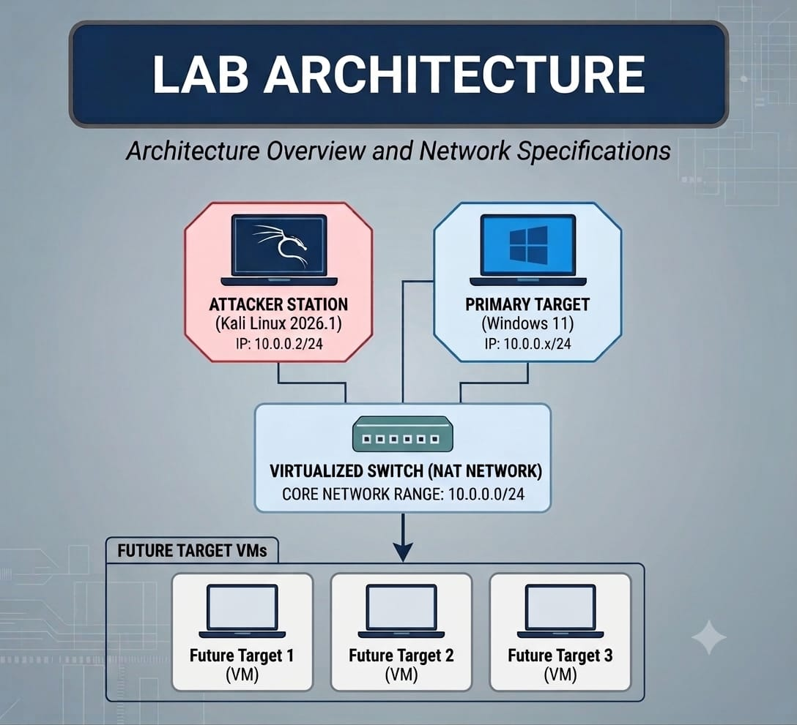

# Cybersecurity Lab Setup

## 📍 Project Overview

This project documents the setup of an isolated virtual cybersecurity laboratory using Oracle VM VirtualBox and Kali Linux.

The lab provides a controlled environment for practicing cybersecurity concepts, network reconnaissance, vulnerability assessment, and penetration-testing techniques in a safe and authorized environment.

The main purpose of this project is to build a hands-on cybersecurity environment where security tools and techniques can be practiced without affecting real-world systems or networks.

## 🎯 Objectives

- Install and configure Oracle VM VirtualBox and Kali Linux.
- Build an isolated virtual cybersecurity laboratory.
- Configure a custom NAT Network for the virtual lab.
- Configure appropriate IP addressing, gateway, and DNS settings.
- Assign and verify network settings for the Kali Linux virtual machine.
- Create virtual machine snapshots for recovery and experimentation.
- Document the complete setup process for future reference and repeatability.

## ⚙️ Lab Environment

| Component                 | Configuration                                    |
| ------------------------- | ------------------------------------------------ |
| Host Operating System     | Windows 11                                       |
| Host RAM                  | 8 GB                                             |
| Processor                 | AMD Ryzen 5 5500U with Radeon Graphics           |
| Virtualization Platform   | Oracle VM VirtualBox 7.1.18-173720-Win           |
| Security Operating System | Kali Linux `kali-linux-2026.1-virtualbox-amd64`  |
| Network Mode              | NAT Network                                      |
| Kali Linux IP             | `10.0.0.2/24`                                    |
| Default Gateway           | `10.0.0.1`                                       |
| DNS Server                | `8.8.8.8`                                        |
| Snapshot                  | My Fresh Kali Linux                              |
| Troubleshooting           | `10.0.0.1` did not work as DNS; `8.8.8.8` worked |
| Lab Purpose               | Cybersecurity Training & Practice                |

This section lists the host system, virtualization software, Kali Linux version, network configuration, and other resources used to build the lab.

## 🖥️ Lab Architecture   

The lab network can be expanded in future projects by adding additional virtual machines for testing and practice.

## 🌐 Network Configuration

A NAT Network was created and configured in Oracle VM VirtualBox for the cybersecurity lab.

| Network Component | Configuration |
| ----------------- | ------------- |
| NAT Network       | `10.0.0.0/24` |
| Gateway           | `10.0.0.1`    |

The Kali Linux virtual machine is connected to this NAT Network.

### Kali Linux Network Settings

| Network Component | Configuration |
| ----------------- | ------------- |
| IP Address        | `10.0.0.2/24` |
| Default Gateway   | `10.0.0.1`    |
| DNS Server        | `8.8.8.8`     |

> **Troubleshooting:** `10.0.0.1` was tested as the DNS server but did not work. `8.8.8.8` was configured and worked successfully.

> **Note:** The network configuration is intended for the isolated cybersecurity laboratory and should not be used to perform unauthorized testing against external systems.

##  Virtual Machine Configuration

The Kali Linux virtual machine was configured with the following settings:

* **RAM:** `2048 MB`
* **Network Adapter:** NAT Network
* **Operating System:** Kali Linux
* **Virtualization Platform:** Oracle VM VirtualBox

## Installation & Setup

### 1. Install VirtualBox

Install Oracle VM VirtualBox on the host Windows system.

Oracle VM VirtualBox was installed on the Windows host to provide the virtualization environment for the cybersecurity lab.

### 2. Obtain Kali Linux

Download the required Kali Linux virtual machine files and extract them using 7-Zip.

The required Kali Linux VirtualBox image was obtained and extracted using 7-Zip before importing it into VirtualBox.

A shared folder was created between the Windows host and Kali Linux VM for easy file sharing.

### 3. Import the Virtual Machine

Import the Kali Linux virtual machine into VirtualBox and verify the virtual hardware configuration.

### 4. Configure the NAT Network

Create the required NAT Network in VirtualBox and configure the lab network.

A dedicated NAT Network was created in VirtualBox to provide the required network environment for the Kali Linux virtual machine.

### 5. Configure Kali Linux Networking

Configure the Kali Linux virtual machine with the required IP address, gateway, and DNS settings.

Kali Linux was configured with the assigned IP address, default gateway, and working DNS server for network communication.

### 🛜 6. Verify Connectivity

Verify the network configuration from Kali Linux using appropriate networking commands.

Network connectivity was tested from Kali Linux to verify communication through the configured gateway and DNS settings.

### 7. 📸 Create a Snapshot

After completing the initial configuration, create a clean virtual machine snapshot.

This snapshot provides a recovery point that can be restored after experiments or configuration changes.

## 🔧 Troubleshooting

### Problem Faced

During the Kali Linux network configuration, the gateway address `10.0.0.1` was initially tested as the DNS server. However, DNS resolution was not working correctly with this configuration.

### Why It Happened

The NAT Network gateway `10.0.0.1` was reachable as the default gateway, but it was not functioning as a DNS resolver in this lab configuration. As a result, network communication through the gateway was available, but domain-name resolution was not working.

### How I Recovered

I tested an alternative DNS server and configured `8.8.8.8` as the DNS server in Kali Linux. After applying the change, DNS resolution worked successfully.

### Result

The Kali Linux virtual machine was successfully configured with:

* **IP Address:** `10.0.0.2/24`
* **Default Gateway:** `10.0.0.1`
* **DNS Server:** `8.8.8.8`

The network configuration was then verified successfully, and a clean snapshot named `My Fresh Kali Linux` was created as a recovery point.

## 🔐 Security tools & practice

The laboratory will be used to practice cybersecurity concepts including:

- Network reconnaissance
- Network scanning
- Service enumeration
- Vulnerability assessment
- Linux security fundamentals
- Network security concepts
- Penetration-testing methodologies

All testing will be performed only against systems that are owned by me or explicitly authorized for testing.

## 📚 What I Learned

### 💻 Virtualization

* Learned how VirtualBox is used to create and manage virtual machines.
* Understood how Kali Linux runs as a virtual machine on a Windows host.

### 🌐 Networking

* Learned how to create and configure a NAT Network.
* Understood the roles of IP address, subnet mask, default gateway, and DNS.

### 🔧 Troubleshooting

* Learned how to identify and resolve a DNS configuration issue.
* Tested different DNS settings and verified the working configuration.

### 📸 Snapshots & Recovery

* Learned how to create a virtual machine snapshot.
* Understood how snapshots provide a recovery point before performing further experiments or making configuration changes.

### 📝 Documentation

* Learned how to document configurations, screenshots, troubleshooting steps, and results in a structured GitHub README.

## 🪜 Learning Goals

This project is part of my hands-on cybersecurity learning journey. The goal is to move beyond theoretical concepts and develop practical experience with:

- Virtualization
- Networking
- Linux
- Cybersecurity tools
- Reconnaissance
- Vulnerability assessment
- Penetration testing
- Security lab management
- 
## 🛠️ Tools Used

### 💻 Virtualization

* **Oracle VM VirtualBox 7.1.18** — (https://www.virtualbox.org/wiki/Downloads)

### 🐉 Operating System

* **Kali Linux 2026.1** — (https://www.kali.org/get-kali/)
* 
### 📦 File Extraction

* **7-Zip** — (https://www.7-zip.org/download.html)

### 📚 Documentation

* **GitHub** —  (https://github.com/)

# 👤 Author

**Neha**
B.Sc. Computer Science Graduate
Cybersecurity Learner

LinkedIn: [Add your LinkedIn profile link]

## 📍 Project Information

**Program Name:** Cybersecurity at Networkwalks | **Week:** 01 | **Project:** Cybersecurity & Pentesting Lab Setup | **Repository:** GitHub

This project is part of the Cybersecurity at Networkwalks Week 01 practical work and focuses on building and documenting a cybersecurity and penetration-testing lab.

