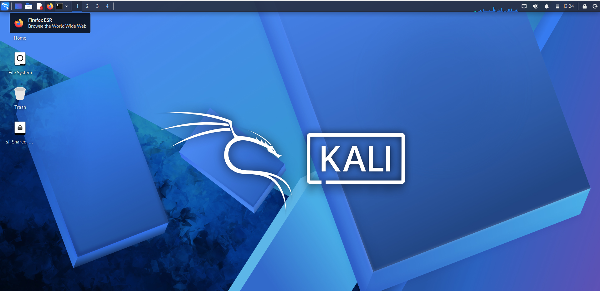
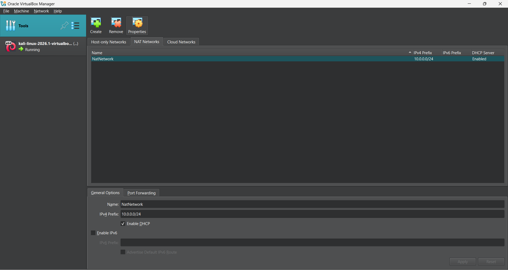
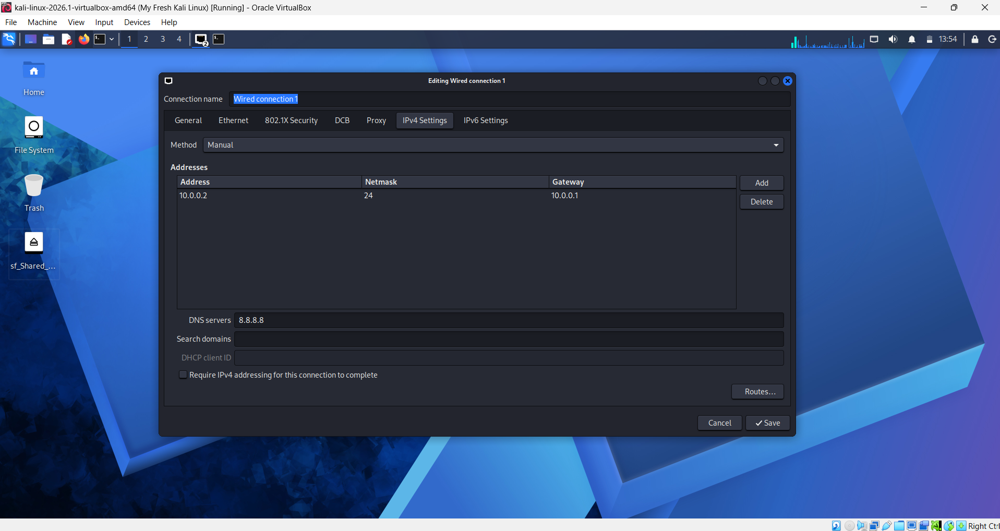
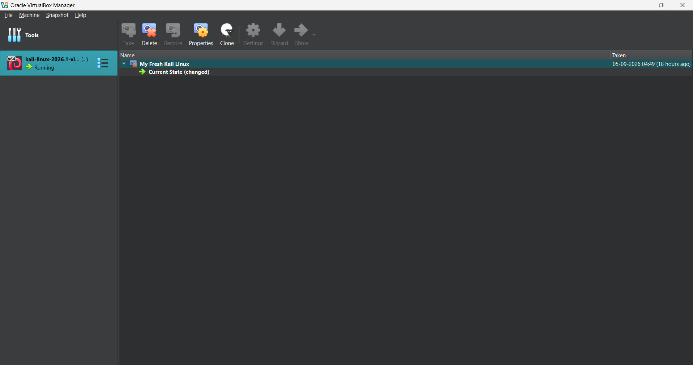

# Cybersecurity Lab Setup

## 📍 Project Overview

This project documents the setup of an isolated virtual cybersecurity laboratory using Oracle VM VirtualBox and Kali Linux.

The lab provides a controlled environment for practicing cybersecurity concepts, network reconnaissance, vulnerability assessment, and penetration-testing techniques in a safe and authorized environment.

The main purpose of this project is to build a hands-on cybersecurity environment where security tools and techniques can be practiced without affecting real-world systems or networks.

## 🎯 Objectives

- Install and configure Oracle VM VirtualBox and Kali Linux.
- Build an isolated virtual cybersecurity laboratory.
- Configure a custom NAT Network for the virtual lab.
- Configure appropriate IP addressing, gateway, and DNS settings.
- Assign and verify network settings for the Kali Linux virtual machine.
- Create virtual machine snapshots for recovery and experimentation.
- Document the complete setup process for future reference and repeatability.

## 🔍 Lab Environment

| Component | Configuration |
|---|---|
| Host Operating System | Windows |
| Virtualization Platform | Oracle VM VirtualBox |
| Security Operating System | Kali Linux |
| Network Mode | NAT Network |
| Lab Purpose | Cybersecurity Training & Practice |

## Lab Architecture   

## 🌐 Network Configuration

The virtual laboratory uses a dedicated NAT Network to provide controlled communication between virtual machines.

| Network Component | Configuration |
|---|---|
| Network | `10.0.0.0/24` |
| Gateway | `10.0.0.1` |
| Kali Linux IP | `10.0.0.2` |
| DNS | `8.8.8.8` |

> **Note:** The network configuration is intended for the isolated cybersecurity laboratory and should not be used to perform unauthorized testing against external systems.

## Virtual Machine Configuration

The Kali Linux virtual machine is configured with:

- RAM: `2048 MB`
- Network Adapter: NAT Network
- Static IP Address: `10.0.0.2`
- Default Gateway: `10.0.0.1`
- DNS Server: `8.8.8.8`

## Installation & Setup

### 1. Install VirtualBox

Install Oracle VM VirtualBox on the host Windows system.

### 2. Obtain Kali Linux

Download the required Kali Linux virtual machine files and extract them using 7-Zip.

### 3. Import the Virtual Machine

Import the Kali Linux virtual machine into VirtualBox and verify the virtual hardware configuration.

### 4. Configure the NAT Network

Create the required NAT Network in VirtualBox and configure the lab network.

### 5. Configure Kali Linux Networking

Configure the Kali Linux virtual machine with the required IP address, gateway, and DNS settings.

### 🛜 6. Verify Connectivity

Verify the network configuration from Kali Linux using appropriate networking commands.

### 7. 📸 Create a Snapshot

After completing the initial configuration, create a clean virtual machine snapshot.

This snapshot provides a recovery point that can be restored after experiments or configuration changes.

## 🔐 Security tools & practice

The laboratory will be used to practice cybersecurity concepts including:

- Network reconnaissance
- Network scanning
- Service enumeration
- Vulnerability assessment
- Linux security fundamentals
- Network security concepts
- Penetration-testing methodologies

All testing will be performed only against systems that are owned by me or explicitly authorized for testing.

## 📃 Documentation

Screenshots, configuration details, commands, observations, and troubleshooting notes will be added to this repository as the lab setup progresses.

## 🪜 Learning Goals

This project is part of my hands-on cybersecurity learning journey. The goal is to move beyond theoretical concepts and develop practical experience with:

- Virtualization
- Networking
- Linux
- Cybersecurity tools
- Reconnaissance
- Vulnerability assessment
- Penetration testing
- Security lab management

# 👤 Author

**Neha**
B.Sc. Computer Science Graduate
Cybersecurity Learner

LinkedIn: [Add your LinkedIn profile link]

## 📌 Project Information

**Program Name:** Cybersecurity at Networkwalks | **Week:** 01 | **Project:** Cybersecurity & Pentesting Lab Setup | **Repository:** GitHub

